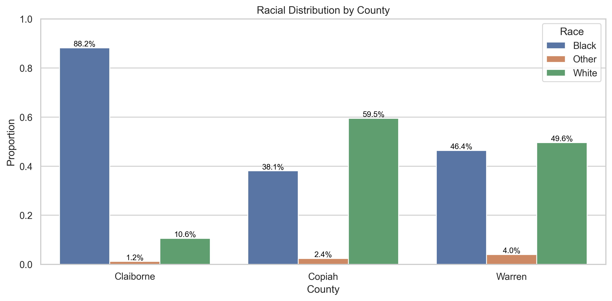
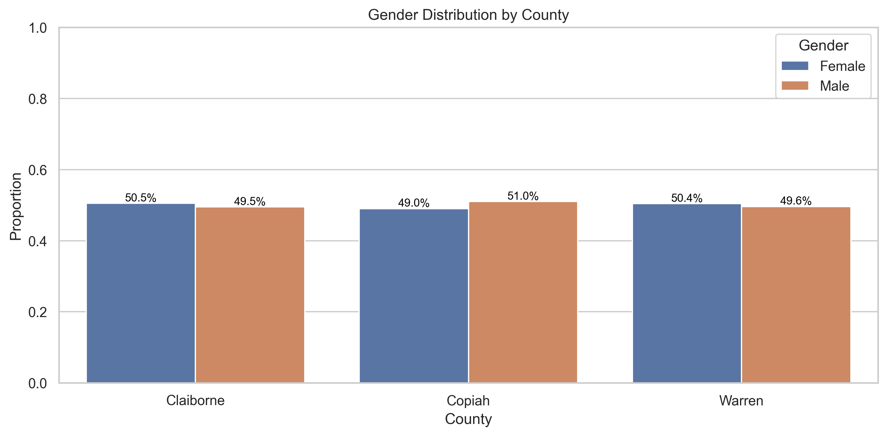
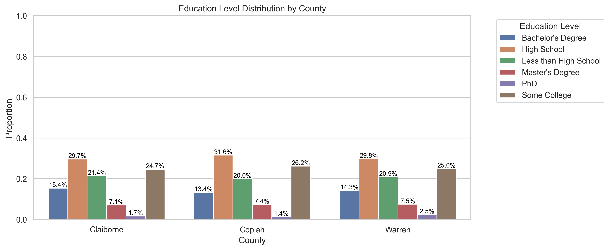
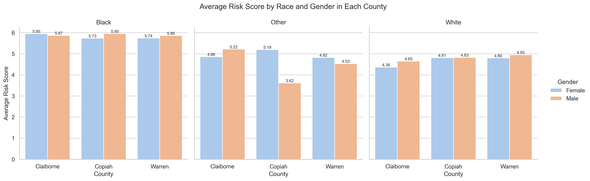
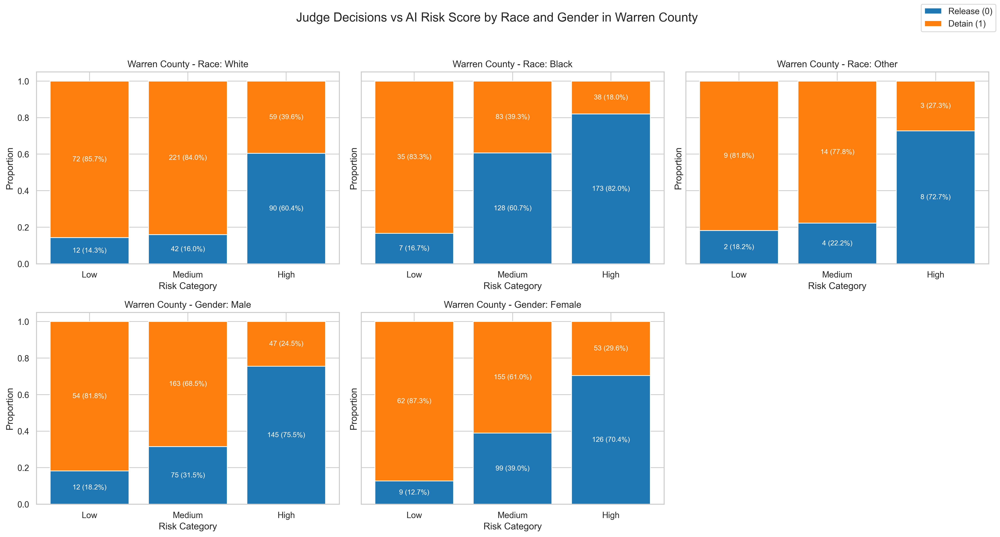
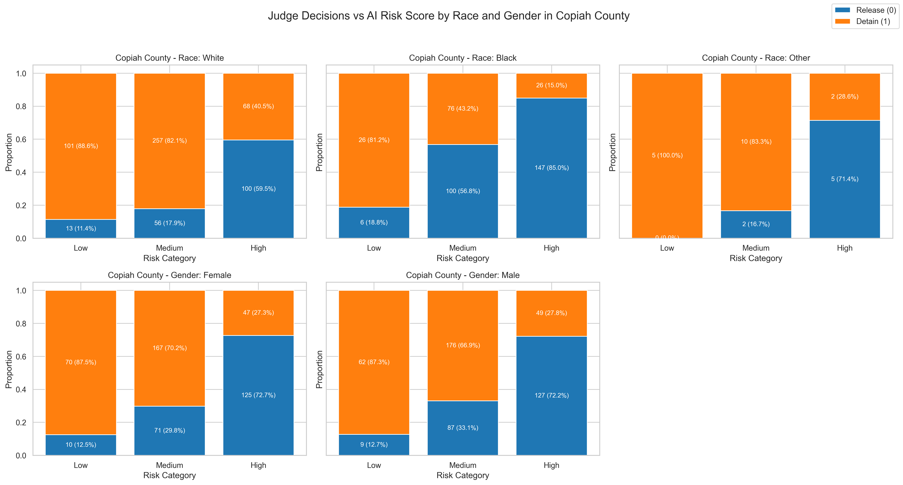
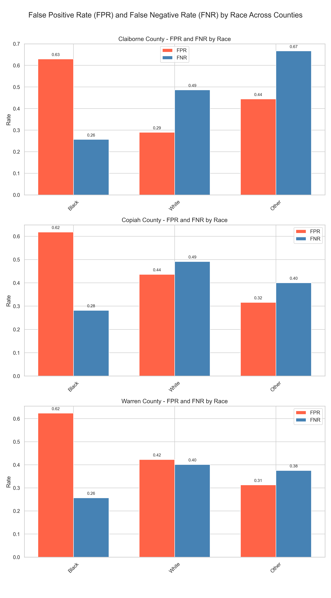

# judgment-by-algorithm

`python analysis.py`

# Visualizations
## Task 1 Analyze the demographic profiles of three counties

## Task 2 Evaluate risk scores across demographic groups

## Task 3 Compare judges’ bail decisions to AI risk scores

## Task 4 Analyze re-offense rates and fairness metrics

